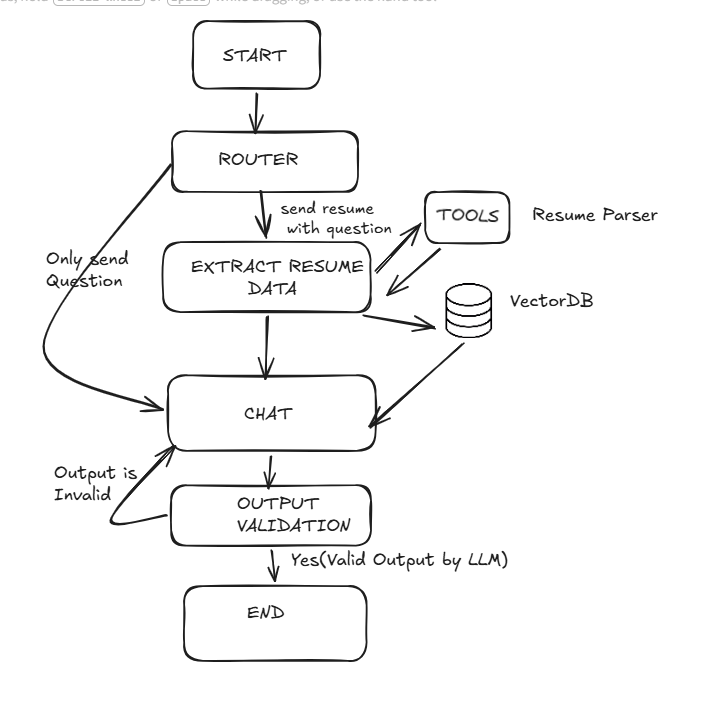

# AI Resume Analysis System

An intelligent resume analysis platform powered by AI agents that extracts, organizes, and helps you explore resume information through conversational interfaces.



## Tech Stack

### Frontend
- **React 18** - UI framework
- **TypeScript** - Type safety
- **Vite** - Build tool
- **Tailwind CSS** - Styling
- **Radix UI** - Component library
- **React Router v6** - Client-side routing
- **Lucide React** - Icons

### Backend
- **FastAPI** - Web framework
- **Python 3.11+** - Runtime
- **LangGraph** - Agent orchestration
- **LangChain** - LLM integrations
- **ChatAnthropic** - Claude Sonnet 4 model
- **Groq** - Llama 3.3 70B model (for resume parsing tool)
- **AstraDB Vector Store** - Vector embeddings storage
- **HuggingFace Embeddings** - Sentence-transformers/all-MiniLM-L6-v2
- **PyPDFLoader** - PDF processing
- **Uvicorn** - ASGI server

### Infrastructure
- **Astra DB** - Cloud-native Cassandra database (vector store)
- **Anthropic API** - Claude AI models
- **GROQ API** - Fast LLM inference

---

## Project Structure

```
Agentic_AI_System/
├── frontend/                    # React frontend application
│   ├── src/
│   │   ├── components/         # React components
│   │   │   ├── ui/             # Base UI components (button, input, card, etc.)
│   │   │   ├── ChatInterface.tsx
│   │   │   ├── ChatMessage.tsx
│   │   │   ├── FileUpload.tsx
│   │   │   ├── ResumeModal.tsx
│   │   │   └── Sidebar.tsx
│   │   ├── pages/             # Page components
│   │   │   ├── Chat.tsx       # Chat interface page
│   │   │   └── ResumeUpload.tsx # Resume upload page
│   │   ├── lib/
│   │   │   └── utils.ts       # Utility functions
│   │   ├── App.tsx            # Main app with routing
│   │   ├── frontend.tsx       # Frontend entry point
│   │   ├── index.ts           # React mount
│   │   ├── index.css          # Global styles
│   │   ├── index.html         # HTML template
│   │   └── react.svg          # React logo
│   ├── public/                # Static assets
│   ├── package.json
│   ├── vite.config.ts
│   ├── tailwind.config.js
│   └── tsconfig.json
│
├── backend/                    # FastAPI backend application
│   ├── ai/                    # AI agent logic
│   │   ├── graph.py          # LangGraph StateGraph definition
│   │   ├── router.py         # Question routing logic
│   │   ├── state.py          # AgentState TypedDict
│   │   └── tools/
│   │       └── resume.py      # Resume parsing tool (Groq LLM)
│   ├── api/                   # API routes
│   │   ├── __init__.py
│   │   ├── router.py
│   │   └── v1/
│   │       ├── __init__.py
│   │       ├── router.py
│   │       └── endpoints/
│   │           ├── __init__.py
│   │           └── graph.py   # Graph endpoints (upload_resume, chat)
│   ├── main.py               # FastAPI application entry point
│   ├── requirements.txt
│   └── .venv/                # Python virtual environment
│
├── images/
│   └── image.png             # Architecture diagram
│
├── .gitignore
└── README.md
```

---

## How to Start

### Prerequisites
- Node.js 18+
- Python 3.11+
- API keys:
  - `ANTHROPIC_API_KEY` - Anthropic/Claude API
  - `GROQ_API_KEY` - Groq API
  - `ASTRA_DB_APPLICATION_TOKEN` - AstraDB token
  - `ASTRA_DB_API_ENDPOINT` - AstraDB API endpoint
  - `ASTRA_DB_KEYSPACE` - AstraDB namespace

### Backend Setup

```bash
cd backend

# Create and activate virtual environment
python -m venv .venv

# Activate virtual environment (Windows)
.\.venv\Scripts\activate

# Install dependencies
pip install -r requirements.txt

# Create .env file with your API keys
# ANTHROPIC_API_KEY=your_key
# GROQ_API_KEY=your_key
# ASTRA_DB_APPLICATION_TOKEN=your_token
# ASTRA_DB_API_ENDPOINT=your_endpoint
# ASTRA_DB_KEYSPACE=your_keyspace

# Start the server
python main.py
```

Backend will run at `http://localhost:8000`

### Frontend Setup

```bash
cd frontend

# Install dependencies
npm install

# Start development server
npm run dev
```

Frontend will run at `http://localhost:5173` (or next available port)

---

## API Endpoints

| Endpoint | Method | Description |
|----------|--------|-------------|
| `POST /v1/graph/upload_resume` | Upload PDF resume for parsing | Accepts `user_id`, `query`, `file` (PDF), returns SSE stream |
| `POST /v1/graph/chat` | Chat with resume context | Accepts `user_id`, `query`, returns SSE stream with AI response |
| `GET /` | Health check | Returns `{"status": "ok"}` |

---

## Agent Workflow

```
User Question → Router → extract_resume_data → [Tools] → chat → Response
                    ↘
                     chat → checkResponse → END
```

1. **Router** - Classifies question as either resume extraction or general chat
2. **extract_resume_data** - Loads PDF, splits chunks, stores in vector DB
3. **Tools** - Resume parser tool using Groq LLM
4. **chat** - RAG-based Q&A using Claude with structured output
5. **checkResponse** - Validates response quality, loops if needed